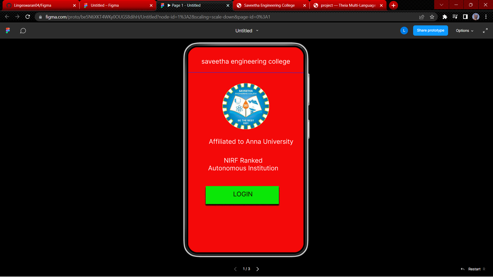
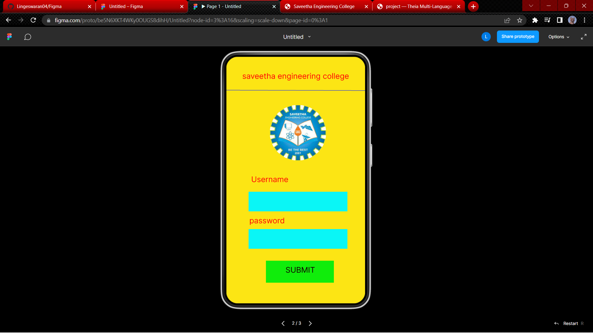
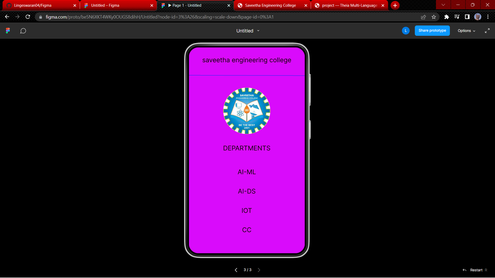

# Event Registration Web Application

## AIM:
To design, develop and deploy a web application for event registration.

## DESIGN STEPS:

### Step 1:
Create a new frame.

### Step 2:
Select any one preset size of your choice.

### Step 3:
Select the shapes you need.

### Step 4:
Import images as needed.

### Step 5:
Create pages based on your need and link them.

### Step 6:

Validate the HTML and CSS code.

### Step 6:

Publish the website in the given URL.

## DESIGN TOOL:
Figma

## code:
```
/* home page */
position: relative;
width: 360px;
height: 640px;
background: #F40909;

/* login page */
position: relative;
width: 360px;
height: 640px;
background: #FCE514;

/* saveetha engineering college */
position: absolute;
width: 298px;
height: 37px;
left: 31px;
top: 27px;
font-family: 'Inter';
font-style: normal;
font-weight: 400;
font-size: 20px;
line-height: 24px;
text-align: center;
color: #0E0101;

/* DEPARTMENTS */
position: absolute;
width: 298px;
height: 37px;
left: 31px;
top: 301px;
font-family: 'Inter';
font-style: normal;
font-weight: 400;
font-size: 20px;
line-height: 24px;
text-align: center;
color: #0E0101;

/* AI-ML */
position: absolute;
width: 298px;
height: 37px;
left: 31px;
top: 375px;
font-family: 'Inter';
font-style: normal;
font-weight: 400;
font-size: 20px;
line-height: 24px;
text-align: center;
color: #0E0101;

/* AI-DS */
position: absolute;
width: 298px;
height: 37px;
left: 31px;
top: 435px;
font-family: 'Inter';
font-style: normal;
font-weight: 400;
font-size: 20px;
line-height: 24px;
text-align: center;
color: #0E0101;

/* IOT */
position: absolute;
width: 298px;
height: 37px;
left: 31px;
top: 495px;
font-family: 'Inter';
font-style: normal;
font-weight: 400;
font-size: 20px;
line-height: 24px;
text-align: center;
color: #0E0101;

/* CC */
position: absolute;
width: 298px;
height: 37px;
left: 31px;
top: 555px;
font-family: 'Inter';
font-style: normal;
font-weight: 400;
font-size: 20px;
line-height: 24px;
text-align: center;
color: #0E0101;

/* Line 3 */
position: absolute;
width: 360px;
height: 0px;
left: 0px;
top: 87px;
border: 1px solid #162CF4;
transform: rotate(0.16deg);

/* logo 3 */
position: absolute;
width: 146px;
height: 144px;
left: 107px;
top: 125px;
background: url(logo.jpg);
border-radius: 126px;
```

## OUTPUT:




## RESULT:
The program to design, develop and deploy a web application for event registration is completed successfully.